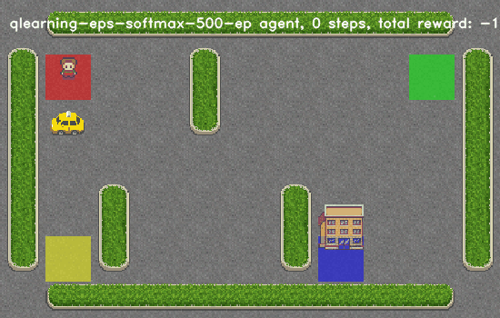
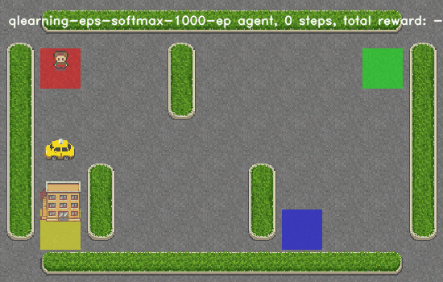
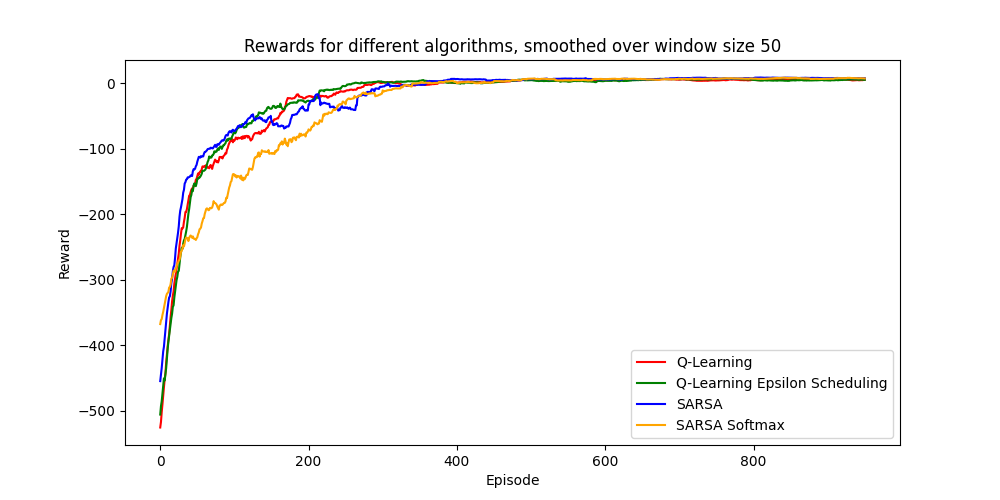

# Rapport du TP3 de Reinforcement learning

## Q-learning

Le Q-learning est un algorithme d'apprentissage par renforcement qui vise à déterminer la meilleure action à prendre dans un environnement pour maximiser la récompense cumulative. Il maintient une table (Q-table) pour chaque paire état-action:

### Implementation et description de l'algorithme

Dans cette section le but sera de presenter le pseudo-code de Q-learning en faisant reference aux methodes implementees. L'algorithme est implemente dans la methode `QLearningAgent.play_and_train` disponible dans [q_learning.py](q_learning.py) et fonctionne de la maniere suivante:

**Initialisation** :

$Q[s,a] \leftarrow 0 \ \forall (s,a) \in \mathcal{S} \times \mathcal{A} $

$\pi$ correespond a la politique de l'agent, initialement il s'agit de la politique $\varepsilon \text{-greedy}$. 

On fixe $\alpha$ le taux d'apprentissage `learning_rate`

**Pour chaque épisode** :
- $s \leftarrow \text{initial state}$

- $\text{terminated} \leftarrow \text{False}$

- $\text{While not terminated}$:

   - $a \leftarrow \text{get\_action}_{\pi}(s)$ // choix de l'action a l'etat $s$ seolon la politique $\pi$ voir la methode `QLearningAgent.get_action(state : State)` 

   - $s',r , \text{terminated} \leftarrow \text{execute}(a)$ // `gym.Env.step(a: Action)`

   - $Q(s, a) \leftarrow Q(s, a) + α * [r + γ * max_{a' \in \mathcal{A}}(Q(s', a')) - Q(s, a)]$ // appel a la methode `QLearningAgent.update(state: State, action: Action, reward: t.SupportsFloat, next_state: State)`
   - $s \leftarrow s' $

#### Politique $\varepsilon \text{-greedy}$

- $\mathbb{P}(a=max_{a' \in \mathcal{A}}(Q(s', a'))\ |\ s'  ) = 1- \varepsilon$

## Q-learning avec un ordonnancement de $\varepsilon$

L'ordonnancement de $\varepsilon$ consiste a fixe une valeur de depart relativement elevee ($\varepsilon_{start}$)  reduire epsilon au fur et a mesure de l'exploration de l'agent vers ($\varepsilon_{end}$). Le but est de permettre une large exploration au debut et de se focaliser porgressivement sur les valeurs de $Q[s,a]$. La diference d'implementation avec `QLearningAgent` se situe dans la methode `update`.

### Implementation de la mise a jour de $\varepsilon$

Voici comment donctionne l'ordonnancement de $\varepsilon$:

- On fixe $\varepsilon_{start}$ et $\varepsilon_{end}$ avec $1 \ge \varepsilon_{start} \ge \varepsilon_{end} \ge 0$
- On fixe $T \leftarrow 10^4$, $T$ correspond a `QLearningAgentEpsScheduling.epsilon_decay_steps` 
- $\varepsilon \leftarrow \varepsilon_{start}$
- $t \leftarrow 0$, $t$ correspond a `QLearningAgentEpsScheduling.timestep`

- A chaque mise a jour dans la methode`QLearningAgentEpsScheduling.update`:
    - $\varepsilon \leftarrow max(\varepsilon_{end}, \varepsilon_{start} - \frac{t}{T} )$
    - $t \leftarrow t +1$

## Sarsa Agent

### Implementation

L'agent Sarsa fonctionne differement que l'agent Q-learning, c'est la raison pour laquelle la methode `SarsaAgent.play_and_train` a ete implementee. Voici son pseudo-code:

**Pour chaque épisode** :
- $s \leftarrow \text{initial state}$

- $\text{terminated} \leftarrow \text{False}$

- $\text{While not terminated}$:

   - $a \leftarrow \text{get\_action}_{\pi}(s)$ // choix de l'action a l'etat $s$ seolon la politique $\pi$ voir la methode `SarsaAgent.get_action(state : State)` 

   - $s',r , \text{terminated} \leftarrow \text{execute}(a)$, `gym.Env.step(a: Action)`

   - $a' \leftarrow \text{get\_action}_{\pi}(s')$ 

   - $Q(s, a) \leftarrow Q(s, a) + α * [r + γ * (Q(s', a')) - Q(s, a)]$, appel a la methode `SarsaAgent.update(state: State, action: Action, reward: t.SupportsFloat, next_state: State, next_action: Action)`
   - $s \leftarrow s'$

   - $a \leftarrow a'$

## Comparison 

###

### Visuels

|      | Q-learning   | Q-learning eps   | SARSA   | SARSA with softmax  policy | Q-learning with softmax policy|
|-----:|:-------------|:-----------------|:--------|:---------------------|:---------------------|
|  250 | |  |  |  |  |
|  500 | |   |  |  |  |
| 1000 |  |  |  |  |  |

### Performances globales

On peut remarquer SARSA sans softmax possed les meilleures performances en se referant a la recompense moyenne au cours des 50 derniers episodes.

Concernant les deux agents sous politique $softmax$, leur progression est tres lente par rapport aux agents a la politique $\varepsilon \text{-greedy}$ mais elle offre de meilleures sur les derniers episodes.