# Rapport du TP3 de Reinforcement learning

## Q-learning

### Implementation

#### Politique $\epsilon$ greedy

## Q-learning avec un ordonnancement de $epsilon$

### Implementation

## Sarsa Agent

### Implementation

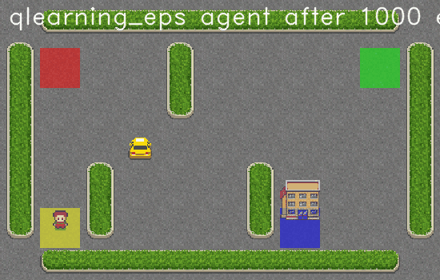

## Comparison 

|      | Q-learning   | Q-learning eps   | SARSA   | SARSA with softmax  policy |
|-----:|:-------------|:-----------------|:--------|:---------------------|
|  250 | 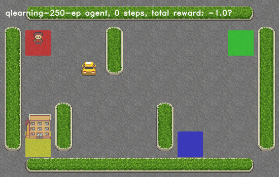| 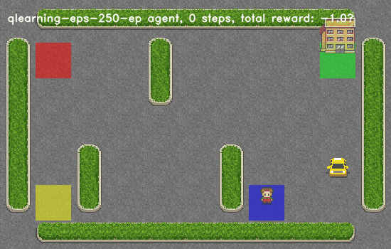            | 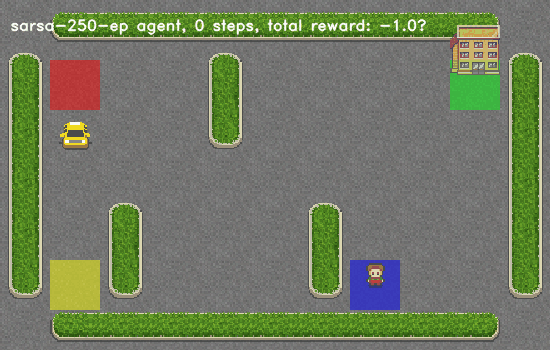   | 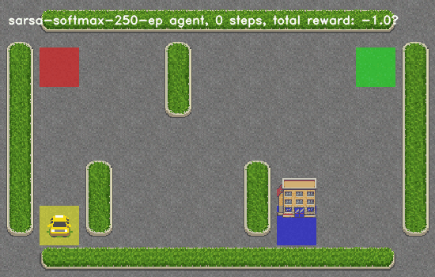                |
|  500 | 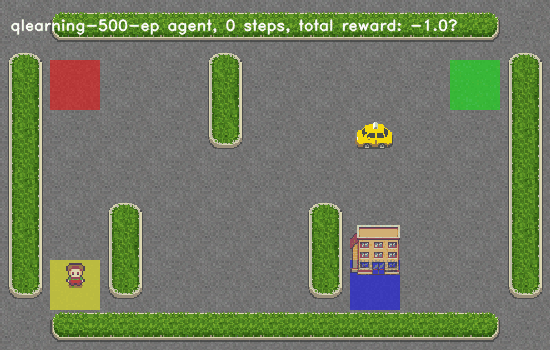        | 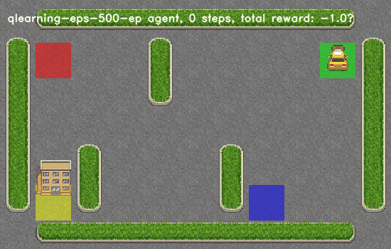            | 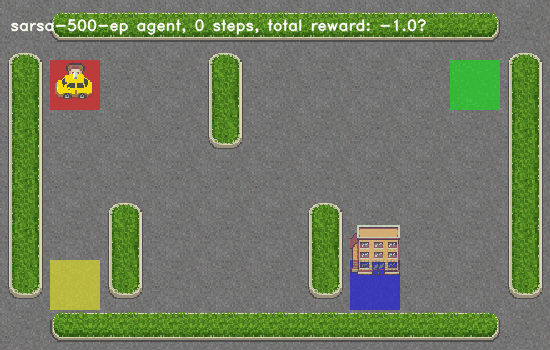   | 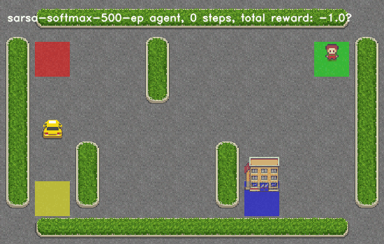                |
| 1000 | 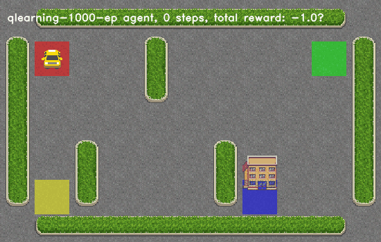        | 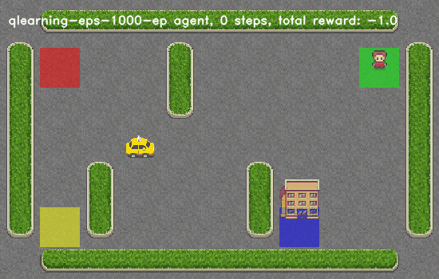            | 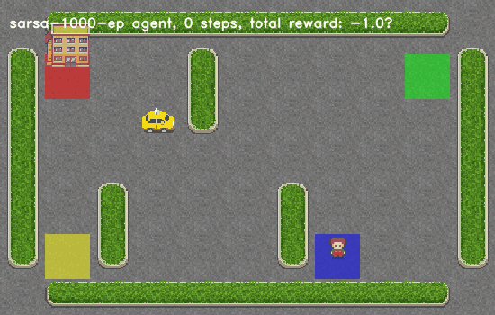   | 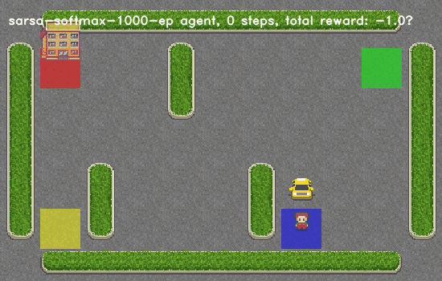                |
