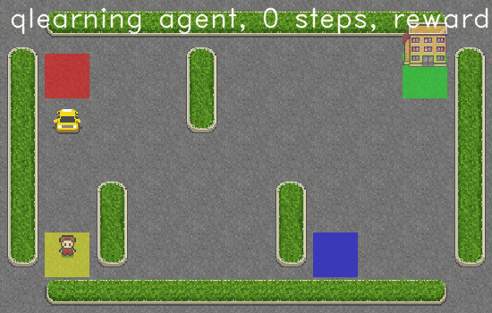

# Rapport du TP3 de Reinforcement learning

## Q-learning

### Implementation

#### Politique $\epsilon$ greedy

## Q-learning avec un ordonnancement de $epsilon$

### Implementation

## Sarsa Agent

### Implementation

#

