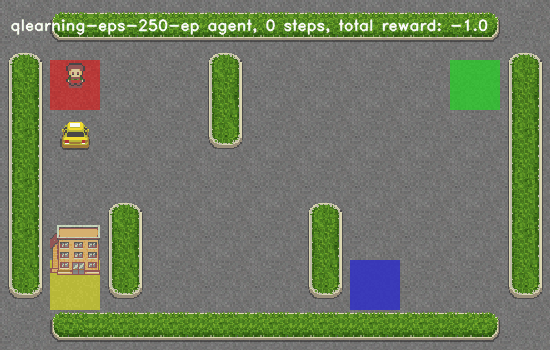
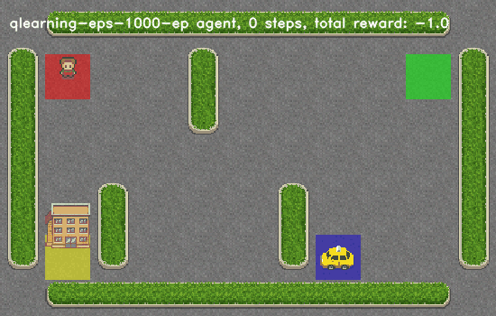
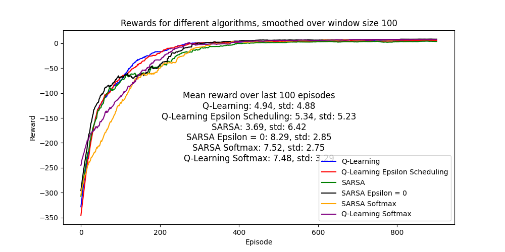

# Rapport du TP3 de Reinforcement learning par [Bastien Hoorelbeke](https://github.com/Bast-94) encadré par [Pierre-Louis Guhur](https://github.com/guhur)

Dans ce travail pratique, plusieurs méthodes d'apprentissage par renforcement seront abordées.

## Q-learning

Le Q-learning est un algorithme d'apprentissage par renforcement qui vise à déterminer la meilleure action à prendre dans un environnement pour maximiser la récompense cumulative. Il maintient une table (Q-table) pour chaque paire état-action.

### Implémentation et description de l'algorithme

Dans cette section, le but sera de présenter le pseudo-code de Q-learning en faisant référence aux méthodes implémentées. L'algorithme est implémenté dans la méthode `QLearningAgent.play_and_train` disponible dans [q_learning.py](q_learning.py) et fonctionne de la manière suivante:

**Initialisation** :

$Q[s,a] \leftarrow 0 \ \forall (s,a) \in \mathcal{S} \times \mathcal{A} $

$\pi$ correspond à la politique de l'agent, initialement il s'agit de la politique $\varepsilon \text{-greedy}$.

On fixe $\alpha$ le taux d'apprentissage `learning_rate`

**Pour chaque épisode** :
- $s \leftarrow \text{initial state}$

- $\text{terminated} \leftarrow \text{False}$

- $\text{While not terminated}$:

- $a \leftarrow \text{get action}_{\pi}(s)$ // choix de l'action à l'état $s$ selon la politique $\pi$ voir la méthode `QLearningAgent.get_action(state : State)`

- $s',r , \text{terminated} \leftarrow \text{execute}(a)$ // `gym.Env.step(a: Action)`

- $Q(s, a) \leftarrow Q(s, a) + α * [r + γ * max_{a' \in \mathcal{A}}(Q(s', a')) - Q(s, a)]$ // appel a la méthode `QLearningAgent.update(state: State, action: Action, reward: t.SupportsFloat, next_state: State)`
- $s \leftarrow s' $

#### Politique $\varepsilon \text{-greedy}$

- $\mathbb{P}(a=max_{a' \in \mathcal{A}}(Q(s', a'))\ |\ s' ) = 1- \varepsilon$

## [Q-learning avec un ordonnancement de $\varepsilon$](./qlearning_eps_scheduling.py)

L'ordonnancement de $\varepsilon$ consiste à fixer une valeur de départ relativement élevée ($\varepsilon_{start}$) réduire epsilon au fur et à mesure de l'exploration de l'agent vers ($\varepsilon_{end}$). Le but est de permettre une large exploration au début et de se focaliser progressivement sur les valeurs de $Q[s,a]$. La différence d'implémentation avec `QLearningAgent` se situe dans la méthode `update`.

### Implémentation de la mise à jour de $\varepsilon$

Voici comment fonctionne l'ordonnancement de $\varepsilon$:

- On fixe $\varepsilon_{start}$ et $\varepsilon_{end}$ avec $1 \ge \varepsilon_{start} \ge \varepsilon_{end} \ge 0$
- On fixe $T \leftarrow 10^4$, $T$ correspond à `QLearningAgentEpsScheduling.epsilon_decay_steps`
- $\varepsilon \leftarrow \varepsilon_{start}$
- $t \leftarrow 0$, $t$ correspond à `QLearningAgentEpsScheduling.timestep`

- A chaque mise a jour dans la    méthode`QLearningAgentEpsScheduling.update`:
- $\varepsilon \leftarrow max(\varepsilon_{end}, \varepsilon_{start} - \frac{t}{T} )$
- $t \leftarrow t +1$

## [SARSA Agent](./sarsa.py) 

### Implementation

L'agent Sarsa fonctionne différemment que l'agent Q-learning, c'est la raison pour laquelle la méthode `SarsaAgent.play_and_train` a été implémentée. Voici son pseudo-code:

**Pour chaque épisode** :
- $s \leftarrow \text{initial state}$

- $\text{terminated} \leftarrow \text{False}$

- $\text{While not terminated}$:

- $a \leftarrow \text{get action}_{\pi}(s)$ // choix de l'action à l'état $s$ selon la politique $\pi$ voir la méthode `SarsaAgent.get_action(state : State)`

- $s',r , \text{terminated} \leftarrow \text{execute}(a)$, `gym.Env.step(a: Action)`

- $a' \leftarrow \text{get action}_{\pi}(s')$

- $Q(s, a) \leftarrow Q(s, a) + α * [r + γ * (Q(s', a')) - Q(s, a)]$, appel à la méthode `SarsaAgent.update(state: State, action: Action, reward: t.SupportsFloat, next_state: State, next_action: Action)`
- $s \leftarrow s'$

- $a \leftarrow a'$

### [Etude la politique softmax](./policy.py)

La fonction softmax est définie par:

$\begin{array}{ccccc}
softmax & : & \mathbb{R}^n & \to & \mathbb{R}^n \\
& & x & \mapsto & \frac{e^{x_i}}{\sum_{j=1}^ne^{j}} \ \forall i \in [1,n] \\
\end{array}$

Ainsi chaque composante $softmax(x)_i$ va donner une probabilité qui augmente à mesure que $x_i$ augmentera. Dans notre cas des politiques d'agents le vecteur d'entrée sera $x_i= Q[s,a_i]$ pour $s$ fixé. Pour un état $s$ l'action suivante $a$ dépendra donc des probabilités obtenue avec softmax. Au départ, comme toutes les valeurs de $Q$ d'un état $s$ sont égales, les prochaines actions auront la même probabilité d'être choisie. Au cours de l'entraînement les actions donnant des valeurs de $Q$ faibles auront une faible probabilité d'être choisie et inversement.

## Comparaison des agents

### Visuels

| | Q-learning | Q-learning eps | SARSA | SARSA with softmax policy | Q-learning with softmax policy|
|-----:|:-------------|:-----------------|:--------|:---------------------|:---------------------|
| 250 | |  |  |  |  |
| 500 | |  |  |  |  |
| 1000 |  |  |  |  |  |

### Performances globales

On peut remarquer SARSA sans softmax possède les meilleures performances en se référant à la récompense moyenne au cours des 100 derniers épisodes.

Concernant les deux agents sous politique $softmax$, leur progression est plus lente que les agents à la politique $\varepsilon \text{-greedy}$ mais elle offre de meilleures sur les derniers épisodes en termes de récompense totale. De plus est leur écart-type est bien plus faible ce qui laisse penser que ces agents obtiennent une récompense moyenne élevée avec une plus grande certitude.

